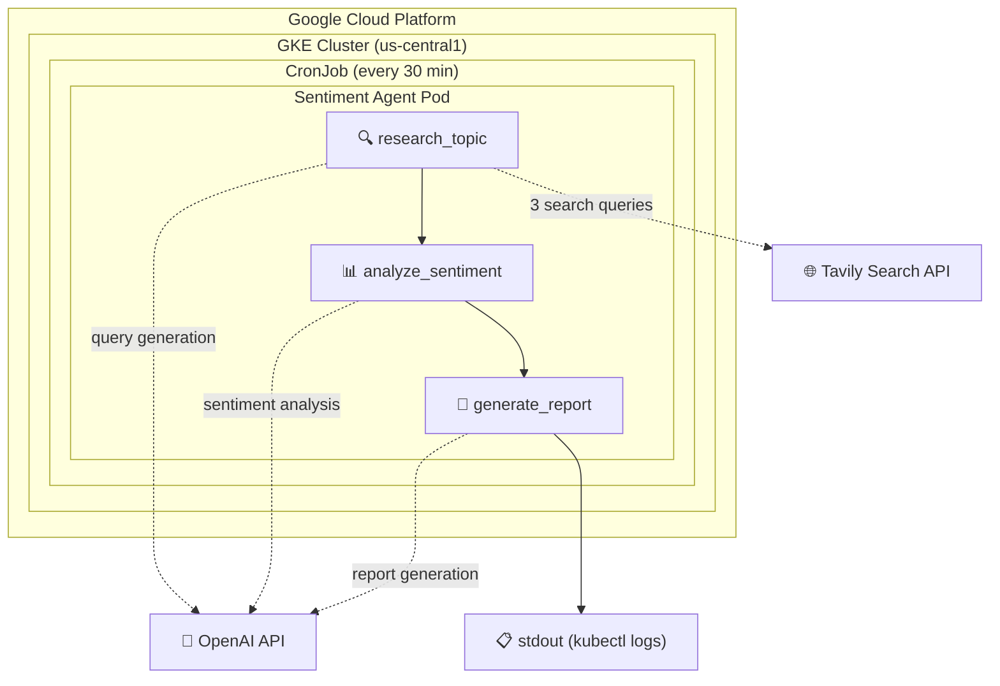
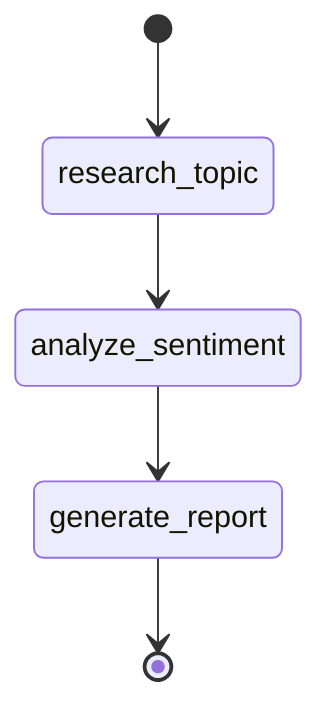
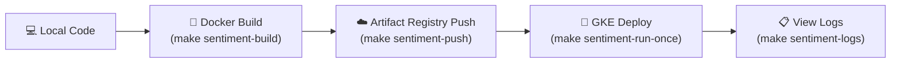

# Design Document: Social Media Sentiment Analysis Agent

## Overview

This project implements a **long-running AI agent** deployed on **Google Kubernetes Engine (GKE)** that monitors social media (primarily X/Twitter) and produces periodic **sentiment and trend reports** on configurable topics. It is built for the ML@B × Google Spring 2026 collaboration.

The agent will be run as a Kubernetes CronJob every 30 minutes, searches for recent social media discussions via [Tavily](https://tavily.com/), analyzes sentiment using OpenAI's GPT-4o-mini via [LangGraph](https://langchain-ai.github.io/langgraph/), and outputs a structured markdown report.

---

## Tech Stack

| Layer | Technology | Purpose |
|---|---|---|
| **Agent Framework** | [LangGraph](https://langchain-ai.github.io/langgraph/) | Stateful, graph-based agent orchestration |
| **LLM** | Currently GPT-4o, will switch to Claude Opus when we have credits | Query generation, sentiment analysis, report generation |
| **Web Search** | [Tavily](https://tavily.com/) | Social media and web search API optimized for LLM agents |
| **Package Manager** | [Pixi](https://pixi.sh/) (conda-forge + PyPI) | Reproducible environments across dev and containers |
| **Containerization** | Docker | Packaging for GKE deployment |
| **Orchestration** | Kubernetes (GKE) | CronJob scheduling, pod management |
| **Infrastructure** | Terraform | GCP resource provisioning (GKE cluster, VPC, KMS) |

---

## Architecture

### System Overview



### LangGraph Agent Pipeline

The agent is implemented as a **3-node linear LangGraph `StateGraph`**:



#### State Schema (`AgentState`)

```python
class AgentState(TypedDict, total=False):
    topic: str                  # The search topic (e.g., "latest hot topics in AI")
    search_queries: list[str]   # Generated search queries
    search_results: str         # Raw Tavily search results (JSON)
    sentiment_analysis: str     # Structured sentiment analysis (JSON)
    final_report: str           # Final markdown report
    timestamp: str              # ISO timestamp of the run
    error: str                  # Error message if any
```

#### Node Details

| Node | Input | Output | External Calls |
|---|---|---|---|
| **`research_topic`** | `topic` | `search_queries`, `search_results` | OpenAI (query generation), Tavily (3 searches) |
| **`analyze_sentiment`** | `topic`, `search_results` | `sentiment_analysis` | OpenAI (analysis) |
| **`generate_report`** | `topic`, `timestamp`, `sentiment_analysis` | `final_report` | OpenAI (report writing) |

#### Node 1: `research_topic`

1. **Query Generation**: Sends the topic to GPT-4o-mini with a prompt engineered to produce 3 targeted search queries:
   - One targeting `site:x.com` / `site:twitter.com`
   - One targeting broader social media (Reddit, Mastodon, Bluesky)
   - One focusing on opinions and reactions
2. **Search Execution**: Runs each query through Tavily's `advanced` search depth, collecting up to 5 results per query (15 total).
3. **Fallback**: If LLM query generation fails (JSON parse error), uses hardcoded default queries.

#### Node 2: `analyze_sentiment`

Sends all search results to GPT-4o-mini with a detailed analysis prompt. Produces structured JSON output containing:
- Overall sentiment (positive/negative/neutral/mixed) with confidence score
- Per-post analysis (stance, emotion, intensity 1-5, source)
- Key themes, contrarian views, and emerging narratives

#### Node 3: `generate_report`

Takes the structured analysis and generates a polished markdown report with 7 sections:
1. 📊 Executive Summary
2. 🔥 Key Findings
3. 📈 Sentiment Breakdown
4. 💬 Notable Voices & Opinions
5. 🔀 Trending Sub-topics
6. ⚡ Contrarian & Minority Views
7. 🔮 Outlook & Emerging Narratives

---

## Project Structure

```
sp26-gke-social-media/
├── sp26_gke/                          # Main Python package
│   ├── workflows/
│   │   ├── sentiment_agent.py         # LangGraph agent (entry point)
│   │   ├── prompts.py                 # Prompt templates
│   │   └── gke_dummy_job.py           # Dummy workflow (starter/reference)
│   └── dummy.py                       # Package placeholder
│
├── cloud/                             # Infrastructure
│   ├── docker/
│   │   ├── sentiment-agent.Dockerfile # Agent container image
│   │   └── gke-dummy.Dockerfile       # Dummy workflow image
│   ├── k8s/
│   │   ├── sentiment-agent/
│   │   │   ├── job.yaml               # One-off K8s Job
│   │   │   └── cronjob.yaml           # Scheduled CronJob (*/30 min)
│   │   └── dummy-workflow/            # Dummy K8s manifests
│   ├── main.tf                        # Terraform: GKE cluster, VPC
│   ├── variables.tf                   # Terraform variables (incl. secrets)
│   └── providers.tf                   # GCP provider config
│
├── secrets/                           # SOPS-encrypted secrets
│   └── secrets.sops.yaml             # Encrypted with GCP KMS
│
├── Makefile                           # All build/deploy/ops commands
├── pixi.toml                          # Pixi environment (conda + PyPI deps)
├── pyproject.toml                     # Python project metadata + deps
└── tests/                             # Pytest test suite
```

---

## Deployment Pipeline

### Build → Push → Deploy



### Makefile Targets

| Target | Description |
|---|---|
| `make sentiment-build` | Build Docker image locally |
| `make sentiment-push` | Push image to GCP Artifact Registry |
| `make sentiment-run-once` | Deploy as a one-off K8s Job |
| `make sentiment-schedule` | Deploy as a CronJob (every 30 min) |
| `make sentiment-delete` | Remove Job and CronJob from cluster |
| `make sentiment-logs` | View pod logs (the sentiment report) |

### Environment Variables

| Variable | Required | Description |
|---|---|---|
| `OPENAI_API_KEY` | Yes | OpenAI API key |
| `TAVILY_API_KEY` | Yes | Tavily search API key |
| `SENTIMENT_TOPIC` | No | Topic to analyze (default: `"latest hot topics in AI"`) |

These can be set in `.env` (auto-loaded by both the Makefile and the Python agent via `python-dotenv`).

### Kubernetes Manifests

API keys are injected into K8s pods via environment variables. The Makefile uses `sed` to replace placeholder tokens (`__OPENAI_API_KEY__`, `__TAVILY_API_KEY__`, etc.) in the YAML manifests at deploy time. The CronJob keeps the last 2 successful and 2 failed job histories.

---

## Prompt Engineering

Three prompt templates live in `sp26_gke/workflows/prompts.py`:

1. **`SEARCH_QUERIES_PROMPT`** — Generates 3 targeted search queries with specific constraints (one must use `site:x.com`, one targets broader social media, one focuses on opinions). Returns a JSON array.

2. **`SENTIMENT_ANALYSIS_PROMPT`** — Deep analysis prompt that extracts per-post stance, emotional tone (excited/angry/fearful/hopeful/sarcastic), intensity (1-5 scale), source attribution, dominant themes, contrarian views, and emerging narratives. Returns structured JSON.

3. **`REPORT_GENERATION_PROMPT`** — Produces a markdown report with 7 mandatory sections. Explicitly instructs the model to be "specific, data-driven, and insightful" and to "avoid filler language."

---

## Secrets Management

- **SOPS + GCP KMS**: Sensitive values are encrypted at rest in `secrets/secrets.sops.yaml` using a GCP Cloud KMS key.
- **`.env` file**: Local development keys (gitignored). Auto-loaded by the Makefile (`-include .env` / `export`) and by the agent (`python-dotenv`).
- **K8s env vars**: For GKE deployment, API keys are passed on the `make` command line and injected via `sed` into the K8s manifests.

---

## Local Development

```bash
# Install everything
pixi install

# Run agent locally
pixi run sentiment-agent

# Run tests
pixi run test

# Lint
pixi run pre-commit-run

# Commit (must use pixi for pre-commit hooks)
pixi run git commit -m "message"
```

---

## Next Steps

<!-- Add your planned work here -->

---
