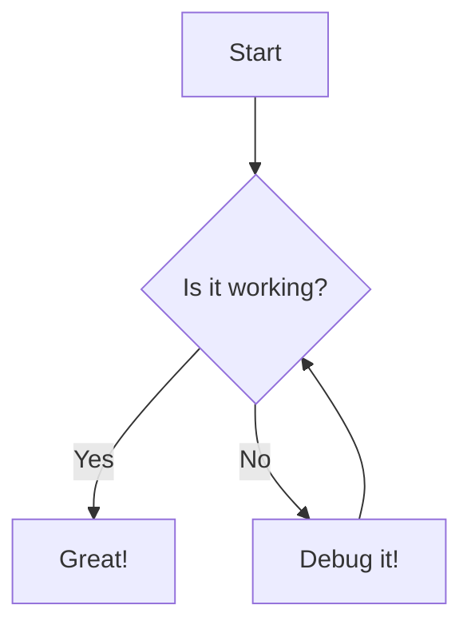

# Documentation

This directory serves as the documentation for this project.

Please put any diagrams, notes, and other documentation here.

e.g. you can use Mermaid to create diagrams like this:

